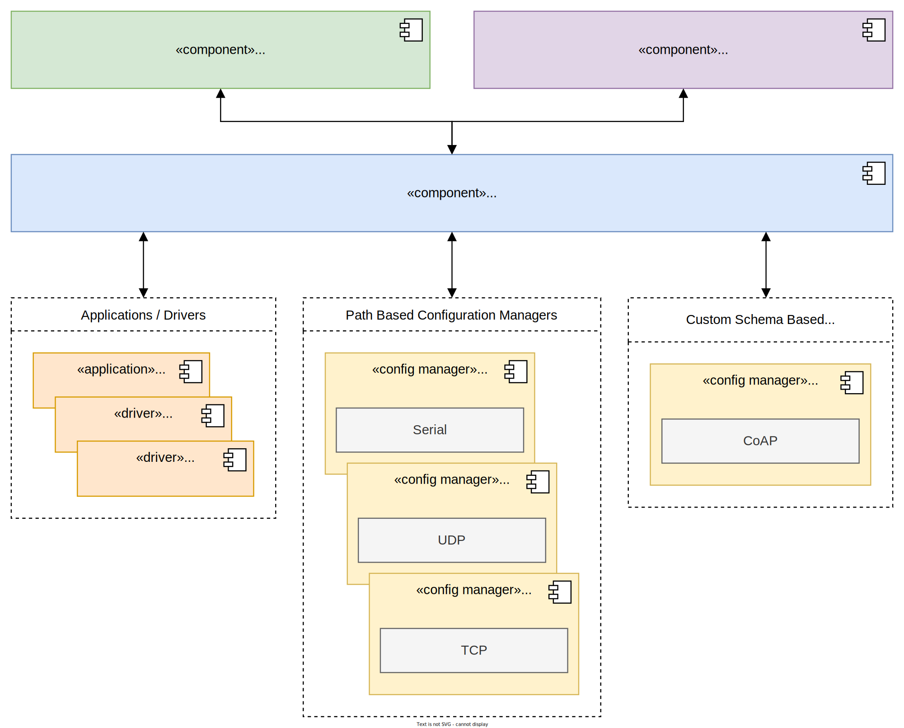

@addtogroup  sys_runtime_config    Runtime configuration

@warning This implementation is not complete and not yet thoroughly tested.
         Please do not use this module in production, as it is missing major
         features and may contain bugs.
         Missing features include:
         - A code generator that transpiles YAML schemas to C code
         - Persistent storage extension
         - Integer path extension
         - String path extension

This module provides a system-level runtime configuration system for RIOT.

A runtime configuration system provides a mechanism to set and get the values of
configuration parameters used during the execution of the firmware, as well as a
way to persist these values. Runtime configurations are deployment-specific and
can be changed on a per-node basis. Appropriate management tools also enable
remote configuration of RIOT nodes.

Examples of runtime configurations include:

- Transmission duty cycles
- Sensor thresholds
- Security credentials
- System state variables
- RGB-LED colors

The runtime configuration system allows you to:

- **Apply** multiple configurations at once.
- **Persist** configurations to non-volatile storage.
- **Expose** configurations to external configuration management tools, such as
  a CLI or a network-based remote tool.

## Design

### Architecture

The architecture, as shown below, is formed by one or more applications or
configuration managers and the runtime configuration API. The runtime configuration
API acts as a common interface to access runtime configurations and store them
in non-volatile storage.

All runtime configurations can be accessed from the RIOT application either
using the provided runtime configuration interfaces or through the interfaces
exposed by the configuration managers. A RIOT application may interact with a
configuration manager to modify access control rules or enable different exposed interfaces.

#### Path-Based Configuration Managers (Needs `int_path` or `string_path` extension)

@warning There are no Path-Based Configuration Managers implemented yet.

These configuration managers mirror the internal structure of the RIOT runtime
configuration tree. They use either the `int_path` or the `string_path` extension
module to expose the parameters via a path of strings or integers.

#### Custom Schema-Based Configuration Managers

@warning There are no Custom Schema-Based Configuration Managers implemented yet.

These configuration managers have their own configuration structure (e.g., custom
predefined object models) and cannot automatically be mapped to or from the
runtime configuration schemas. To make them work, a custom mapping module must
be implemented per configuration manager, mapping each configuration parameter from
the RIOT runtime configuration module to the correct format of the configuration manager.



### Configuration Structure

The runtime configuration system interacts with RIOT modules via **configuration schemas**,
and with non-volatile storages via **storages**. This ensures the functionality
of the runtime configuration remains independent of specific module or storage implementations.

Through this structure, it is possible to get or set the values of **configuration parameters**.
It is also possible to apply configurations, export their values to a buffer, or
print them. To persist configuration values, they can be stored in non-volatile storages.

Mechanisms for security (such as access control or encryption of configurations)
are **not** directly in the scope of the runtime configuration module, but are
handled by the configuration managers and the specific implementations of the
configuration schemas and storages.

The graphic below shows an example of two configuration namespaces (`SYS` and `APP`).
The `APP` namespace contains an application-specific `My app` configuration schema,
and the `SYS` namespace specifies a `WLAN` and an `LED Strip` configuration schema.
The application `My app` uses the custom `My app` schema to expose custom parameters.
Meanwhile, the drivers `WS2812`, `SK6812`, and `UCS1903` contain instances of
the `LED Strip` configuration schema to expose common LED strip parameters.

Additionally, there are two storages available: `MTD` and `VFS`. The `MTD` storage
internally uses the RIOT `MTD` driver, while the `VFS` storage internally uses
the RIOT `VFS` module.


### Components

The runtime configuration system is split into multiple components, as seen in the graphic below:

#### Runtime Configuration Core

```makefile
USEMODULE += runtime_config
```

This component holds the most basic functionality of the runtime configuration system.
It allows you to `set` and `get` configuration values, transactionally `apply` them
so changes take effect, and `list` all configuration parameters that exist in a
given namespace, schema, or group. Furthermore, it provides the ability to `add`
namespaces or schema instances.

#### Runtime Configuration Namespace

The configuration namespaces (such as `SYS` or `APP`) and their respective schemas
are not inherently part of the runtime configuration module itself. It is possible
to `add` custom configuration namespaces depending on your specific application needs.


## API

The graphic below illustrates the API of the runtime configuration system.
The top shows the Core API for managing configuration parameters. On the right-hand side
are functions to `set`, `get`, `apply`, and `list` configuration parameters to a buffer
or terminal. On the left-hand side are setup functions to `add` namespaces and schema instances.

The functionality of these functions is detailed in the following sections.


## Usage

### Add Namespaces

To be able to use configuration schemas and their parameters, you must first add
a configuration namespace that will contain the required schemas.

This is done using the `RUNTIME_CONFIG_ADD_NAMESPACE` macro, providing the
name of the namespace and a pointer to a `runtime_config_namespace_t` object.

```c
#define RUNTIME_CONFIG_ADD_NAMESPACE(_name, _namespace)
```

### Add Configuration Schema Instances

To expose runtime configurations, it is necessary to add an instance of the
required configuration schema.

This is done using the `runtime_config_add_schema_instance` function, providing
the schema and the schema instance as arguments.

```c
#include "runtime_config.h"
#include "runtime_config/namespace/sys.h"
#include "runtime_config/namespace/sys/board_led.h"

static runtime_config_error_t board_led_instance_apply_cb(
    const runtime_config_group_or_parameter_id_t *group_or_parameter_id,
    const runtime_config_schema_instance_t *instance)
{
    /* Handle configuration changes */
    return RUNTIME_CONFIG_ERROR_NONE;
}

static runtime_config_sys_board_led_instance_t board_led_instance_data = {
    .enabled = 0,
};

static runtime_config_schema_instance_t board_led_instance = {
    .data = &board_led_instance_data,
    .apply_cb = &board_led_instance_apply_cb,
};

/* Assuming runtime_config_sys_board_led is defined elsewhere */
runtime_config_add_schema_instance(&runtime_config_sys_board_led, &board_led_instance);
```

### Get Configurations

A configuration value can be retrieved using the `runtime_config_get` function.
The function takes a pointer to a `runtime_config_node_t` as input, alongside
a double pointer to a buffer and a pointer to the buffer's size.

After execution, the output pointer (`*buf`) will point directly to the internal
buffer holding the actual configuration value, and `*buf_len` will hold its size.

```c
runtime_config_error_t runtime_config_get(
    const runtime_config_node_t *node,
    void **buf,
    size_t *buf_len
);
```

### Set Configurations

A configuration value can be set using the `runtime_config_set` function.
The function takes a `runtime_config_node_t`, a `const void *` buffer containing
the new value, and the buffer's size as its arguments.

The buffer must contain the value in its correct C data type. For example, if
the configuration schema expects a `uint8_t` but a `uint16_t` is provided,
the operation will fail.

```c
runtime_config_error_t runtime_config_set(
    const runtime_config_node_t *node,
    const void *buf,
    const size_t buf_len
);
```

### Apply Configurations

Once the value(s) of one or multiple configuration parameters are changed via
the `runtime_config_set` function, they still need to be applied for the new
values to take effect.

Parameters can be applied using the `runtime_config_apply` function. This function
applies every configuration parameter currently available in the runtime configuration
tree that is a direct or indirect child of the specified location.

When a whole schema instance or a single configuration parameter is applied, it
is passed to the `apply_cb` handler of the schema instance (provided by the module
that owns the configuration). This ensures the module is notified when parameters
are applied and can react to the changes accordingly.

```c
runtime_config_error_t runtime_config_apply(const runtime_config_node_t *node);
```

### List Available Configurations

Sometimes it is necessary to see what configuration namespaces, schemas, instances,
groups, or parameters are currently available within the deployment.

This information can be retrieved using the `runtime_config_traverse_config_tree`
function. This function iterates over every configuration object available in the
configuration tree, restricted to the scope of the provided `node` argument.

Each traversed node will be passed to the `tree_traversal_cb` callback provided
as an argument.

```c
runtime_config_error_t runtime_config_traverse_config_tree(
    const runtime_config_node_t *node,
    const runtime_config_tree_traversal_cb_t tree_traversal_cb,
    const uint8_t tree_traversal_depth,
    const void *context
);
```
